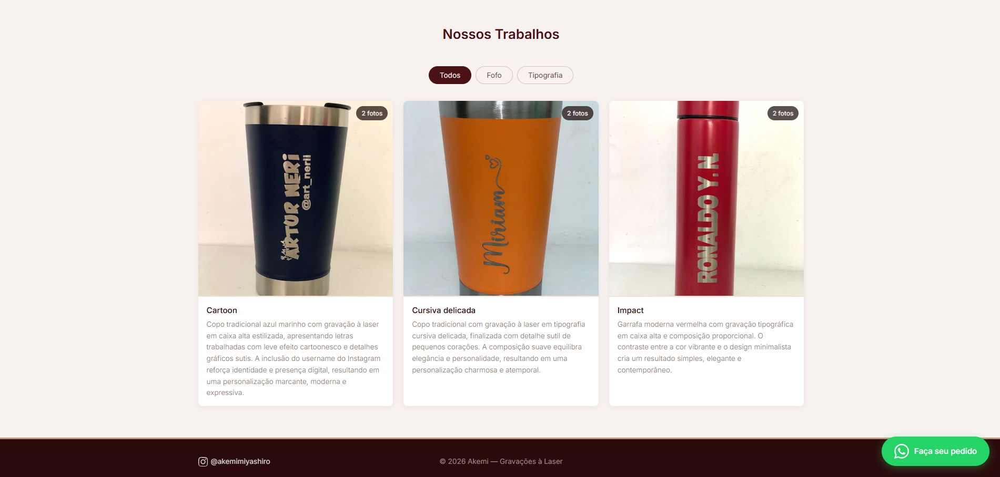

<h1 align="center"> Portfolio de Gravações à Laser </h1>

  <a href="#-tecnologias">Tecnologias</a>&nbsp;&nbsp;&nbsp;|&nbsp;&nbsp;&nbsp;
  <a href="#-projeto">Projeto</a>

 

  

## 🚀 Tecnologias

Esse projeto foi desenvolvido com as seguintes tecnologias:

- HTML e CSS
- JavaScript
- Github

## 💻 Projeto

Um portfólio para a Akemi postar seus trabalhos com visualização organizada por meio de filtros..

Desenvolvido por <a href="https://www.linkedin.com/in/artur-neri/">Artur Neri</a> e <a href="https://www.linkedin.com/in/larissakmnakamura/">Larissa Nakamura</a>.